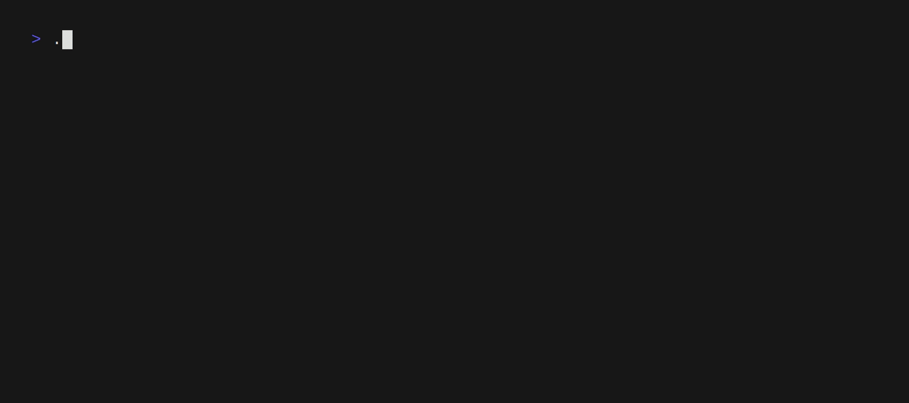

# rusty_colors
A quick, simple, random color generation tool, written in Rust!
## Features
- Ability to add practically any number of colors (limited by the `usize` max value which should be more than anyone needs)
- Ability to 'reroll' all colors that are unlocked
- Ability to toggle 'lock' colors to prevent them from being rerolled
- Ability to navigate between colors
- Ability to move where a color is in the list
- Ability to exit a sub-menu or quit the program 
### Keybindings
| Keybind      | Action                                                 |
| ------------ | ------------------------------------------------------ |
| ?            | Toggles the help menu                                  |
| q            | Leaves sub-menu or quits the program if at main screen |
| k/Up         | Move up by one color, looping at the top               |
| j/Down       | Move down by one color, looping at bottom              |
| K/Shift+Up   | Move selected color up by one, looping at top          |
| J/Shift+Down | Move selected color down by one, looping at bottom     |
| a            | Append a new, random color at the bottom of the list   |
| s            | Toggle the lock state of the selected color            |
| Space        | Reroll all unlocked colors                             |
## Planned Features
- [ ] Insert a new color in the middle of the list with `n`
- [ ] Export to a `.sh` file for use in scripting
- [ ] Save colors to a `.toml` file for future loading
- [ ] Load from a `.toml` to edit a saved set of colors
- [ ] HSL constraint settings to only generate select ranges of colors
- [ ] Manual HSL and RGB manipulation sliders
- [ ] HSL color representations
