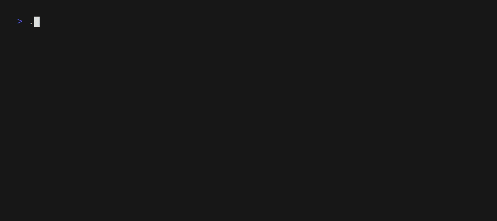

# Saswatch
A quick, simple, color generation tool, written in Rust.
**Notice**: I am currently a full-time student and don't have as much time to work on the project as I would like. As of now the plan is to refactor a lot of the code, as I've gotten better with Rust since when I first wrote this. So hopefully in the near future the codebase will be a bit more organized. However, it is a little tricky to say when that will be as of writing this.

More will be added to this as the rewrite progresses and the development plan is a litte more solidified.
